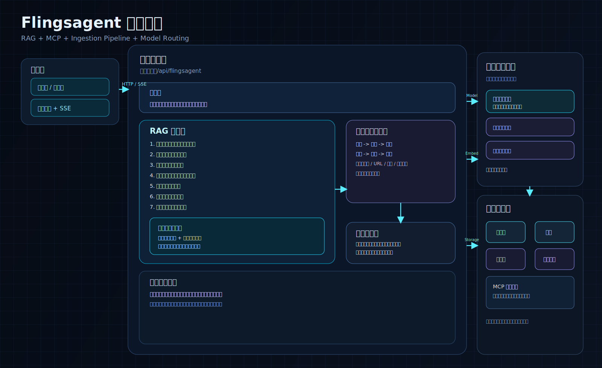

<div align="center">

# 🟠 Flingsagent

**企业级 Agentic RAG 平台 · 从文档入库到多智能体协作问答的全链路**

[](https://openjdk.org/)
[](https://spring.io/projects/spring-boot)
[](https://react.dev/)
[](https://github.com/pgvector/pgvector)
[](#-许可证)

</div>

---

Flingsagent 在传统 RAG 之上引入 **Orchestrator–Worker 多智能体协作**：规划智能体拆解任务，知识库 / 工具等专家智能体并行执行，汇总智能体流式生成答案，反思智能体对证据充分性做闭环校验。后端 **Spring Boot 3 + Java 17** 多模块 Maven 工程，前端 **React 18 + Vite + TypeScript**。

<p align="center">
  
</p>

## ✨ 核心特性

- 🤖 **多智能体编排** —— Planner（规划）→ 并行 Worker（知识库检索 / MCP 工具）→ Synthesis（汇总流式生成）→ Critic（反思补充检索）的协作闭环
- 🔍 **多通道并行检索** —— 向量检索 + 意图定向检索，可插拔的 `SearchChannel` 与后处理链（去重 / Rerank / 质量过滤）
- 🔌 **MCP 工具生态** —— 通过 Model Context Protocol 接入外部工具，由 LLM 自动提参并路由调用
- 🔀 **模型路由与熔断** —— 多供应商（Bailian / Ollama / SiliconFlow / AIHubMix）优先级路由 + 三态熔断器 + 首包探测降级
- 🧠 **对话记忆** —— 滑动窗口 + 摘要压缩
- 📊 **全链路追踪** —— `@RagTraceNode` 自动落库，前端时序图与多智能体协作面板可视化
- ⚡ **流式问答** —— SSE 实时回写最终答案与各智能体的协作进度

## 🤖 一次问答的多智能体协作

```
记忆加载 ─► PlannerAgent（改写 / 意图 / 计划）
          │
          ├─► 短路：意图歧义 → 澄清引导
          ├─► 短路：纯系统意图 → 系统响应
          │
          ├─► 并行 Worker ┬─ KnowledgeAgent（多通道检索）
          │               └─ ToolAgent（MCP 工具调用）
          │
          ├─► CriticAgent 反思（证据不足 → 补充检索重试）
          │
          └─► SynthesisAgent ─► SSE 流式生成最终答案
```

> 可通过配置项 `rag.agent.enabled` 在「多智能体编排」与「传统线性链路」之间一键切换，便于灰度与对比。

## 🏗️ 模块分层

依赖方向 `bootstrap → framework`、`bootstrap → infra-ai`，`mcp-server` 独立部署。

| 模块 | 职责 |
|---|---|
| **`framework`** | 业务无关的横切基础设施：三级异常体系、双维度幂等、Snowflake、链路追踪、SSE 封装、MQ 事务消息抽象 |
| **`infra-ai`** | 屏蔽模型供应商差异：`ChatClient` / `EmbeddingClient` / `RerankClient` + 优先级路由 + 三态熔断 |
| **`bootstrap`** | 业务实现：多智能体编排、多通道检索、知识库、节点化入库 Pipeline、用户体系 |
| **`mcp-server`** | 独立的 MCP 工具服务（9099 端口） |

## 🚀 快速开始

> 依赖 **PostgreSQL**（需 `CREATE EXTENSION vector` 安装 pgvector）与 **Redis**。在环境变量中配置 `BAILIAN_API_KEY` 等模型密钥后即可开始问答。

**后端**

```bash
# 首次构建（spotless 会在 compile 阶段自动补 Apache 2.0 license 头）
./mvnw clean install -DskipTests

# 启动主应用（端口 9090，context-path /api/flingsagent）
./mvnw -pl bootstrap spring-boot:run

# 启动 MCP Server（端口 9099，被主应用通过 rag.mcp.servers 调用）
./mvnw -pl mcp-server spring-boot:run
```

**前端**

```bash
cd frontend
npm install
npm run dev      # 开发服务器 http://localhost:5173，/api 代理到 9090
npm run build
```

## 🧩 扩展点

所有能力遵循「实现接口 + `@Component` 注册」即可扩展，无需改动框架：

| 接口 | 作用 |
|---|---|
| `Agent` | 新增智能体（规划 / 专家 Worker / 汇总 / 反思） |
| `SearchChannel` | 新检索通道（向量 / 意图 / 关键词等） |
| `SearchResultPostProcessor` | 检索后处理链（去重 / Rerank / 自定义过滤） |
| `IngestionNode` | 文档入库 Pipeline 节点 |
| `ChatClient` / `EmbeddingClient` / `RerankClient` | 新模型供应商 |

## 📄 许可证

本项目源码遵循 [Apache License 2.0](https://www.apache.org/licenses/LICENSE-2.0)。
